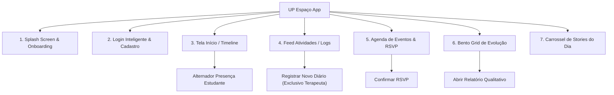

# 🧱 Plano de Atividades: Damacena (Mapa, Arquitetura & Código)

Olá, Damacena! Como **Tech Lead (CTO)** da nossa agência no projeto **UP Espaço**, seu foco é o design técnico do sistema, a especificação das ferramentas e o detalhamento da nossa arquitetura base.

Abaixo estão os detalhes técnicos que você deve dominar e apresentar:

---

## 🗺️ 1. Mapa de Funcionalidades do Aplicativo

A aplicação é dividida em 6 módulos fundamentais acessados via barra inferior de navegação:



---

## 🏗️ 2. Arquitetura Tecnológica e Stack

Decidimos por uma arquitetura moderna baseada em **Contêineres Independentes**, facilitando o deploy em produção e garantindo a saúde do sistema:

* **Frontend**: Desenvolvido em **React (v19)**, TypeScript e estilizado com **Tailwind CSS v4** (usando a diretiva `@theme` para a identidade visual). É compilado estaticamente em arquivos JS/HTML e servido de forma leve pelo **Nginx**.
* **Banco de Dados (db)**: Instância isolada do **PostgreSQL 16** persistida via volumes Docker.
* **Coletor Prometheus**: Configurado para monitorar alvos a cada 15 segundos raspando métricas do backend.
* **Grafana**: Servido na porta `3001` para plotar painéis analíticos sobre uso de recursos e tráfego da API.

---

## 💻 3. Detalhes de Programação e Diferenciais

Como arquiteto, você deve destacar os seguintes pontos de excelência técnica na nossa engenharia:

### A. Camada de Serviços Desacoplada com Fallback
Criamos um padrão de isolamento em [api.ts](file:///c:/Users/Braga/Desktop/frontend_up/src/services/api.ts). O arquivo exporta a classe `apiService` que usa Promises nativas para simular a chamada assíncrona da API.
* Se `import.meta.env.VITE_API_URL` não for declarada, o frontend consome e atualiza variáveis locais na memória de fallback (mocks).
* No momento em que o backend for ligado, basta declarar o endereço na variável e todo o aplicativo passará a chamar a API REST automaticamente, sem quebrar a UI.

### B. Gerenciamento Reativo no App.tsx
O [App.tsx](file:///c:/Users/Braga/Desktop/frontend_up/src/App.tsx) inicializa os estados chamando a camada de serviços em um `useEffect` assíncrono:
```tsx
  useEffect(() => {
    const loadInitialData = async () => {
      try {
        const studentData = await apiService.getStudent();
        setStudent(studentData);
        // ... repete para posts, events e timeline
      } catch (err) {
        console.error(err);
      }
    };
    loadInitialData();
  }, []);
```

### C. Multi-stage Dockerfile
O [Dockerfile](file:///c:/Users/Braga/Desktop/frontend_up/Dockerfile) utiliza multi-stage builds para não carregar a pasta `node_modules` para o ambiente final de produção, mantendo a imagem final com menos de 50MB:
```dockerfile
# Stage 1: Build
FROM node:20-alpine AS builder
...
RUN npm run build

# Stage 2: Runner
FROM nginx:alpine
COPY --from=builder /app/dist /usr/share/nginx/html
```
